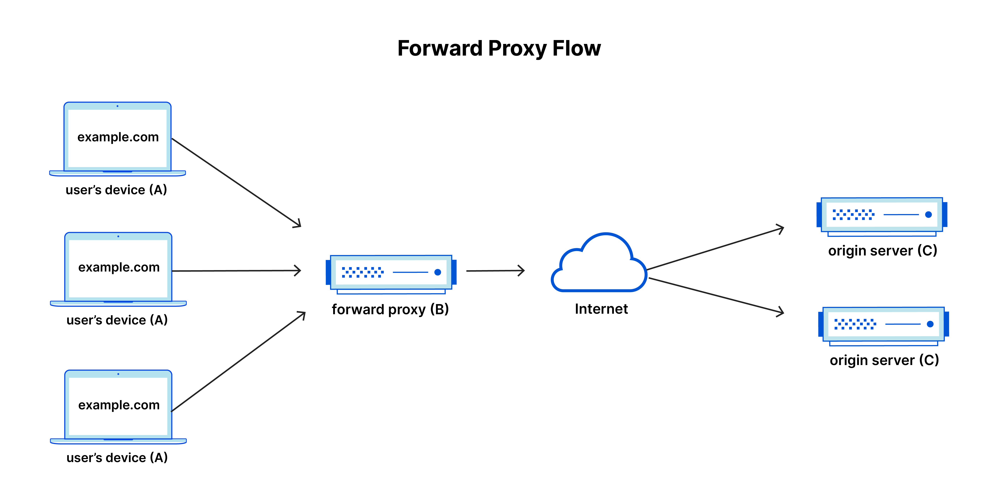

# Reverse Proxy

- 웹 서버 앞에 위치하여 클라이언트 요청을 웹 서버에 전달하는 것
- 보안, 성능, 안정성을 향상하기 위해 구성

# Proxy server

- 클라이언트 시스템 그룹 앞에 위치하는 서버
- 인터넷 사이트 및 서비스에 요청하면 프록시 서버가 이 요청을 가로채고 중개자처럼 대신하여 웹서버와 통신

# 정방향 프록시 VS 역방향 프록시




- 역방향 프록시는 클라이언트의 요청을 프록시 서버가 대신 받아 요청을 처리해줌
- 부하 분산
    - 단일 원본 서버로 들어오는 모든 트래픽을 처리하지 못하는 것을 방지하고자 동일한 사이트에 대한 요청을 다른 서버 풀에 분산해줌
- 공격으로부터 보호
    - 원본 서버의 ip주소를 공개할 필요가 없으므로 DDos 공격과 같은 표적 공격으로 부터 보호하기 쉬움
- 전역 서버 부하 분산
    - 분산되어 있는 서버중 역방향 프록시는 클라이언트를 지리적으로 가장 가까운 서버로 전송
    - 요청과 응답의 이동 거리가 줄어들어 로드 시간이 감소
- 캐싱
    - 응답 데이터를 캐시(임시 저장)하여 후속 사용자는 캐시된 버전을 사용하여 성능이 향상
- SSL 암호화
    - 모든 요청을 해독하고 나가는 모든 응답을 암호화

# HTTPS 인증서 발급

## snap을 사용하여 설치

```bash
sudo apt update
sudo apt install snapd    # snap 설치

sudo snap install hello-world    # 제대로 설치되었는지 확인
hello-world 6.4 from Canonical✓ installed
hello-world
Hello World!
```

## Certbot 설치

```bash
sudo snap install --classic certbot
```

## Cerbot 실행

```bash
sudo certbot --nginx   # certbot이 nginx 설정을 자동으로 변경
sudo certbot certonly --nginx    # 사용자가 nginx 설정을 따로 해주어야 함
```

## https 설정

### 도메인 구입

- 가비아에서 도메인 www.whereareu.shop을 구매하고 ec2서버의 ip주소를 할당하였다.
    
    
    
    
    

### EC2 고정 ip

- DNS서버에 도메인 정보가 등록되는데 약 2시간이 걸리는데 인스턴스를 중지할 때마다 시간낭비가 심하다
- EC2서버를 중지해도 ip주소가 변경되지 않도록 탄력적 ip 주소를 사용하였다.

- EC2→ 네트워크 및 보안 → 탄력적 IP
    
    
    

- 탄력적 IP 주소 할당
    
    
    
- 모두 기본 설정으로 하고 할당을 한다.
    
    
    
- 해당 과정을 거치면 인스턴스를 중지하더라도 ip주소가 바뀌지 않아 도메인에 매핑을 다시 시켜주지 않아도 된다.

### Certbot으로 SSL 인증

- DNS서버에 도메인이 안정적으로 등록이 되었다면 해당 코드를 실행하여 SSL 인증서를 받아야한다.

```bash
sudo certbot --nginx   # certbot이 nginx 설정을 자동으로 변경
sudo certbot certonly --nginx    # 사용자가 nginx 설정을 따로 해주어야 함
```

# NGINX 설치

## 필수 패키지 설치

```bash
sudo apt install curl gnupg2 ca-certificates lsb-release ubuntu-keyring
```

## Nginx apt 저장소 공개키 다운로드

```bash
curl https://nginx.org/keys/nginx_signing.key | gpg --dearmor \
    | sudo tee /usr/share/keyrings/nginx-archive-keyring.gpg >/dev/null
```

## 유효한 공개키인지 검사

```bash
gpg --dry-run --quiet --no-keyring --import --import-options 
 import-show /usr/share/keyrings/nginx-archive-keyring.gpg
```

- fingerprint가 `573BFD6B3D8FBC641079A6ABABF5BD827BD9BF62`과 같은지 확인

## Nginx apt 저장소 세팅

```bash
echo "deb [signed-by=/usr/share/keyrings/nginx-archive-keyring.gpg] \
http://nginx.org/packages/ubuntu `lsb_release -cs` nginx" \
    | sudo tee /etc/apt/sources.list.d/nginx.list
```

## 패키지 저장소 우선순위 변경

```bash
echo -e "Package: *\nPin: origin nginx.org\nPin: release o=nginx\nPin-Priority: 900\n" \
    | sudo tee /etc/apt/preferences.d/99nginx
```

## Nginx 설치

```bash
sudo apt upadate
sudo apt install nginx

sudo systemctl restart nginx #설정을 바꾸면 무조건 재시작을 해주어야 한다.
sudo systemctl start nginx #nginx 실행
sudo systemctl stop nginx #nginx 중지
```

